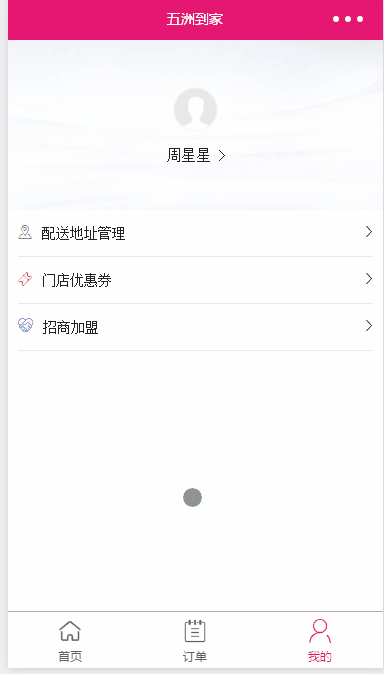
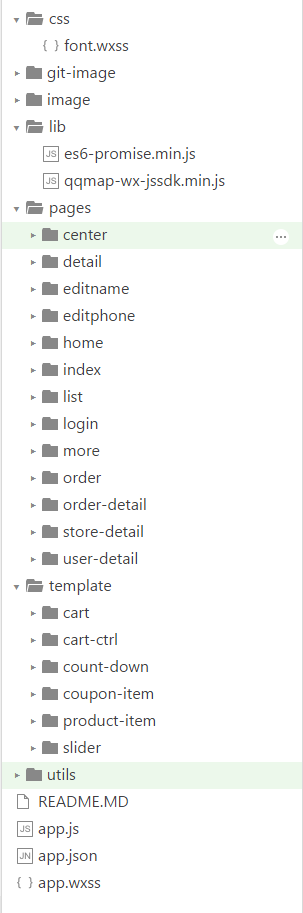

# 微信小程序实战

## 版本：0.15.152900（暂未升级原因：升级后需要图片无法本地引用，必须使用image或是远程路径引用）

## 先上一波gif图片

## gif对应功能块
> * 首页（定位成功情况且有门店）
> * 门店列表（定位成功情况却没有门店）
> * 更多（定位没有成功情况也没有门店）
> * 产品详情页
> * 门店详情
> * 更多门店
> * 订单及订单详情
> * 个人中心
> *  优惠券

## 目录结构

> * css => 放置公用wxss,目前只有一个font.wcss
> * image => 静态资源目录
> * lib => 第三方库（如：qqmap-wx-jssdk.min.js）
> * pages => 小程序页面（包括四个文件，.wxml/.wxss/.js/.json）
> * template => 抽离出来的template，具有复用性
> * utils => 工具类
> * app.js/app.json/app.wxss => 配置


## 踩过的坑

### 1. promise封装
官方request代码： 
```javascript
wx.request({
  url: 'test.php', //仅为示例，并非真实的接口地址
  data: {
     x: '' ,
     y: ''
  },
  header: {
      'content-type': 'application/json'
  },
  success: function(res) {
    console.log(res.data)
  }
})
```
但是有很多场景需要promise化的，所以使用第三方promise库（es6-promise.min.js），对request进行了一层包装： 
```javascript
/* utils/util.js */
/* api接口promise 柯里化*/
var Promise = require('../lib/es6-promise.min.js'); 
function wxPromisify(fn, scope) {  
  return function (obj = {}) {    
    return new Promise((resolve, reject) => {      
      obj.success = function (res) {        
        resolve(res);      
      }      
      obj.fail = function (res) {        
        reject(res);      
      }
      if(scope){
        //改变this指向
        var newFn = fn.bind(scope);
        newFn(obj);
      }else{
        fn(obj);
      }      
    })  
  }
}
/* request 封装*/
var wxrequest = wxPromisify(wx.request);
function wxRequest(options, tokenNotRequired){
    return wxrequest(options).then(res => {
      var data = res.data;
      if(data.status === 404404) {
          if(tokenNotRequired){
                delete options.headers;
                return wxRequest(options);
          }else{
                return updateToken().then(token => {
                    return wxRequest(object.assignIn(options, {
                        headers: { 'X-Auth-Token': token }
                    }));
                });
          }
      }else {
          return Promise.resolve(data);
      }
    }).catch(err => {
      return Promise.reject(err);
    });
}
```
### 2. Javascript作用域问题
由于小程序默认给的微信地图api有些需求达不到要求，于是使用第三方库（qqmap-wx-jssdk.min.js，这是绝配），这样定位功能也比较好做，以及后续要做的地址管理模块也比较好下手，但是有个问题，对微信地图jdk接口进行promise化后，使用过程会报错，导致定位失败，所以需要改变其执行作用，于是对wxPromisify()方法做了些改造，重新绑定作用域至qqmapsdk，调用如下： 
```javascript
//address.js
// 引入SDK核心类
var QQMapWX = require('../lib/qqmap-wx-jssdk.min.js');
// 实例化API核心类(需要配置安全域名https://apis.map.qq.com)
var qqmapsdk = new QQMapWX({
    key: 'xxxxx' //需要到腾地图上申请key
});

...
...

// 请求用户授权定位
//逆地址解析
var ReverseGeocoder = util.wxPromisify(qqmapsdk.reverseGeocoder, qqmapsdk); //需改变作用域

```
对于小程序是需要配置对应的安全域名的，这样才能执行request

### 3. 如何衍生出组件模板
模板页（template）没有天生配对js，但是也可以实现，实现面向对象的思想，对模板所需要的js进行一层类的封装，保证构造函数需要接受父页面的上下文对象，然后可以把声明好的类方法绑定到父页面上面去，对于模板页js方法，以_FUN()方式命名。下面是为图片懒加载优化而做的swiper模板组件，可以参考一下。 
```javascript
/**
 * 图片预加载组件
 *
 * @author xiaobin_wu
 * template/silder/silder.js
 */
class Slider {
    constructor(pageContext, options = { picList: [], showArr:[] }){
        this.page = pageContext; //获取页面上下文
        this.page.data.slider = {
            picList: options.picList,
            showArr: options.showArr
        }; //初始化data
        this.page._sliderChange = this._sliderChange.bind(this);
    }
    //监听滑动事件，实现图片懒加载
    _sliderChange(e){
        if(this.page.data.slider.showArr){
            let showArr = this.page.data.slider.showArr;
            for(let i = 0; i < showArr.length; i++){
                if(i === e.detail.current){
                    showArr[i] = true;
                }
            }
            this.page.setData({
                'slider.showArr': showArr
            });
        }
    }
    initData(imgs){
        const arr = new Array(imgs.length).fill(false);
        this.page.setData({
            'slider.picList': imgs,
            'slider.showArr': arr.fill(true, 0 , 1)
        });
    }
}
module.exports = Slider

```
以类形式module.exports出去，Page页面，以`var Slider = require('../../template/slider/slider.js');`形式引入，然后`new`操作，模板wxml也参考`template/silder/silder.wxml`，也可以对应写wxss，这样做模板页复用性高，类似组件的模式。

### 4. scroll-view使用scroll-x失效问题
刚开始使用scroll-view，scroll-x一直失效，不能水平scroll，折腾了好多时间，结果这样就成了，大概如下结构（home.wxml）：
```html

<scroll-view  scroll-x="{{true}}" scroll-left="{{scrollLeft}}"  class="scroll-bar" style="width:100%;" >
    <view style="width: {{idxData.navbar.length * 168}}rpx">
        <view wx:for="{{idxData.navbar}}" wx:for-item="cate" class="cate-item {{index == currentIndex ? 'active' : ''}}" data-id="{{cate.nav_id}}" data-index="{{index}}" bindtap="cateClick">{{cate.nav_name}}</view>
    </view>
</scroll-view>

```
忽略其他乱起八糟的代码，主要是这个`<view style="width: {{idxData.navbar.length * 168}}rpx">`,需要保证scroll-view下面的view的width必须要大于100%，充满整个scroll-view

### 4. swiper高度无法自动撑开，暂时不支持
 于是对于红线部分的产品分类swiper，就只能手动计算swiper高度，来实现swiper的效果，但是由于对应每个swiper-item还会有个下拉加载，所以产品数目会一直变化，所以计算起来相当于耗性能，希望官方能尽快让swiper高度允许自动撑开

### 5. template模板
template模板，对象传递方式=>`data={{a: x1,b: x2}}`，x1、x2对应data绑定的变量

### 6. setData设置动态数据
可能你会遇到这种情况（设置动态数据）： 
```javascript
this.setData({
    'array[0]': 1
});
/*
    上面这样设置是没问题的，但是是动态的，那该怎么办？这样...

 */
this.setData({
    'array['+ index +']': 1
});
/*
    很遗憾，无法怎么做

*/
```
解决办法，声明中间量，如下：
```javascript
/* utils/util.js */
//动态setData
function dynamicSetData(field, index, value, suffix, type='object'){
    var param = {};
    var string = field + '[' + index + ']' + (typeof suffix !== 'undefined' ?  type === 'object' ? '.' + suffix  : '[' + suffix + ']' : '');
    param[string] = value;
    return param;
}
```
这样最后就可以这样，`this.setData(util.dynamicSetData('firstLoadDataFlag', index, true));`，即可用于对象的改变，也可以用于数组的改变。

### 7. 设置顶层标签Page的样式，处理安卓机的背景色问题

### 8 px与rpx之间转化
对于小程序中，也有一些组件需要传递变量单位为px的，如果这个变量是需要计算出来的，但是我们使用的确是rpx单位，那么他们之间的转化比例是有必要知道的 
```javascript
/* utils/util.js */
//获取px与rpx之间的比列
function getRpx(){
    var winWidth = wx.getSystemInfoSync().windowWidth;
    return 750/winWidth;
}
```

### 8. image问题
image组件，其实对于src图片路径，是以背景图展示的，并不是真的类似img，auto是不生效的。

### 9. wx.navigateBack返回无法传参数通知
wx.navigateBack返回通知上一页执行指定函数的作用，可以使用getCurrentPages()来获取上一页page对象，事先执行，如下： 
```javascript
/* pages/order-detail/order-detail.js */
//返回执行上一个页面的函数,good
navigateBackFun: function(){
  var pages = getCurrentPages();
  var prevPage = pages[pages.length - 2];
  if(prevPage.__route__.indexOf("pages/order/order") != -1) {
        prevPage.actionCallback(this.data.btnAction,this.data.page);
  }
}
```

### 10. class可以多组操作
```html
 <view class="status-item {{index == orderData.progress.last_index? 'active' : ''}} {{index === orderData.progress.info.length - 1 ? 'last-status-item' : ''}}"></view>
```

### 11. 对于字体文件的使用
对于下面的字体文件的引用会导致报错，微信小程序似乎不支持怎么使用
```css
@font-face {
  font-family: 'Glyphicons Halflings';

  src: url('/assets/fonts/glyphicons-halflings-regular.eot');
  src: url('/assets/fonts/glyphicons-halflings-regular.eot?#iefix') format('embedded-opentype'), url('/assets/fonts/glyphicons-halflings-regular.woff2') format('woff2'), url('/assets/fonts/glyphicons-halflings-regular.woff') format('woff'), url('/assets/fonts/glyphicons-halflings-regular.ttf') format('truetype'), url('/assets/fonts/glyphicons-halflings-regular.svg#glyphicons_halflingsregular') format('svg');
}
```
解决办法，将ttf文件拿出，转化成base64，以wxss引入。[base64转化](https://transfonter.org/)


### 12. 购物车功能
对于购车功能也是相当折腾的，通过在app.js定义全局变量：
```javascript
cartData:{
    list:[],
    totalCount:1,
    totalPrice:0,

    // 起送价
    floorPrice:0,

    // 总价达到此价免配送费
    freeShipPrice:0,

    // 运费
    deliveryFee:0,

    storeId:0,
    storeName:''
}
```
然后每次加减产品，清空购物车来操作cartData的变化，list存储购物车产品数据，在首页和产品详情页，可以来获取购物车的数据，当然也会把购物车数据的商品id和门店id存储到Storage，可以用来异步更新最新的购物车数据，在首页和产品详情页的来回切换，对于购物车需要时刻去检查，映射到对应分类的swiper产品的加减变化，这里有没有像vue中vuex的状态管理能对数据集中管理，（对于vuex的使用 [点击](https://github.com/xiaobinwu/Wuji)），导致监听变化变得很复杂，有把加减部件cart-ctrl和购物车cart提取成template模板组件，结果处理起来，这里一万个省略号，很悲催！